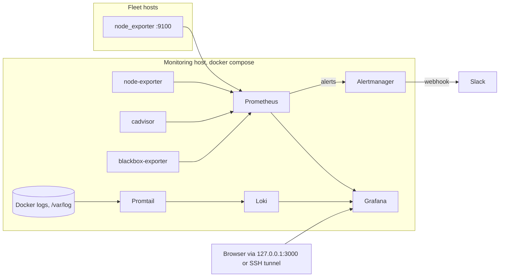

# observability-stack

Metrics, logs, alerting and dashboards for a small fleet of Linux hosts, as one Docker Compose project. Everything is provisioned from files in this repository: datasources, dashboards, alert rules, Slack routing, retention. `docker compose up -d` gives a working system with nothing to click through, and every change is a commit.

It is built for the case where one machine monitors a handful of servers: a monitoring host runs Prometheus, Alertmanager, Loki and Grafana, the fleet runs node_exporter, and the monitoring host also watches its own containers and probes a list of URLs.

## How data flows



## What you get

- Prometheus 3 with 30 day retention, file based service discovery for fleet hosts, and 26 alerting rules with runbook lines in [docs/alerts.md](docs/alerts.md).
- Alertmanager with Slack routing by severity, grouping, a critical over warning inhibition rule and a `Watchdog` heartbeat. The webhook comes from `.env`; the config is rendered at start-up from a template.
- Grafana with the Prometheus, Loki and Alertmanager datasources provisioned and three dashboards: Node Overview (per host CPU, memory, disk, network, load), Containers (cadvisor plus a Loki log panel) and Alerts Overview (what is firing, pending, silenced, and whether notifications get out).
- Loki (single binary, filesystem storage, 14 day retention) and Promtail shipping every container's stdout and stderr plus `/var/log/*.log` from the monitoring host.
- node-exporter, cadvisor and the blackbox exporter (HTTP 2xx, ICMP and TCP modules).
- Recording rules for the dashboards, unit tests for the alert rules, and a CI workflow that runs yamllint, `docker compose config`, promtool, amtool, dashboard checks, shellcheck and actionlint.

Pinned images: `prom/prometheus:v3.14.0`, `prom/alertmanager:v0.34.1` (rebuilt locally with envsubst), `grafana/grafana:13.2.2`, `grafana/loki:3.7.8`, `grafana/promtail:3.6.11`, `prom/node-exporter:v1.12.1`, `ghcr.io/google/cadvisor:v0.60.6`, `prom/blackbox-exporter:v0.28.0`.

## Quick start

Requirements: Docker Engine 24 or newer with the Compose plugin, on a Linux host. About 1 GB of RAM for the stack at rest.

```bash
git clone https://github.com/michealzs/observability-stack.git
cd observability-stack
cp .env.example .env
$EDITOR .env             # GRAFANA_ADMIN_PASSWORD and SLACK_WEBHOOK_URL at least
make validate            # promtool, amtool and compose checks, all inside containers
make up                  # builds the alertmanager image and starts everything
make ps                  # wait until every service is healthy or running
```

Open <http://127.0.0.1:3000> and log in with the admin user and password from `.env`. The dashboards are in the Observability folder; Node Overview is the home dashboard. Within a minute the monitoring host itself shows up under instance `node-exporter:9100`, its containers under Containers, and `Watchdog` under Alerts Overview.

Working on a remote monitoring host: `ssh -L 3000:127.0.0.1:3000 user@monitoring-host` and open the same URL locally.

`make` on its own lists the other targets (`logs`, `reload`, `lint`, `ports`, `down`).

## Adding a host

Install node_exporter (the `node_exporter` role in [ansible-linux-baseline](https://github.com/michealzs/ansible-linux-baseline) does this), allow TCP 9100 and ICMP from the monitoring host, then:

```bash
scripts/add-node.sh 10.0.10.13 --env prod --role web
```

That appends the host to `prometheus/targets/nodes.yml` and reloads Prometheus. The same list feeds the ICMP probe job. URLs to probe over HTTP go in `prometheus/targets/http.yml`. Details, firewall examples and how to verify are in [docs/adding-hosts.md](docs/adding-hosts.md).

## Alerting

Alerts flow Prometheus, Alertmanager, Slack. Routing lives in `alertmanager/alertmanager.yml.tmpl`:

| Severity | Receiver | Group wait | Repeat | Resolved messages |
| --- | --- | --- | --- | --- |
| critical | slack-critical | 15s | 1h | yes |
| warning | slack-warning | 30s | 4h | yes |
| info | slack-info | 30s | 24h | no |

Alerts are grouped by `alertname`, `job` and `severity`, so ten hosts with the same problem produce one message listing ten instances. A critical alert inhibits the warning version of the same alert on the same instance (the 3 day certificate expiry over the 30 day one, for example), and `NodeExporterDown` inhibits the rest of that host's alerts. `Watchdog` fires permanently and is routed to the `null` receiver; point a dead man's switch at it if you want to know when the pipeline itself dies.

Every rule has a severity, a `for` window, a summary and a description with the current value. The full list with what to do for each is in [docs/alerts.md](docs/alerts.md).

Silence with `amtool` inside the container (Alertmanager is not published on the host):

```bash
docker compose exec alertmanager amtool --alertmanager.url=http://localhost:9093 \
  silence add alertname=HostHighCpuLoad instance=10.0.10.11:9100 --duration=2h --comment="batch job"
```

Change the Slack channel with `SLACK_CHANNEL` in `.env`; edit the template for anything else, then `make validate` and `docker compose up -d alertmanager`.

## Retention and sizing

| Component | Retention | Where to change it | Disk, order of magnitude |
| --- | --- | --- | --- |
| Prometheus | 30 days | `PROM_RETENTION` in `.env` | 0.5 to 1 GB per host per 30 days at a 15s scrape interval, plus about the same for cadvisor on a host with ten containers |
| Loki | 14 days | `limits_config.retention_period` in `loki/loki-config.yml` | Roughly a tenth of the raw log volume; a quiet fleet stays under 1 GB |
| Alertmanager | 120 hours of notification log and silences | Alertmanager defaults | A few MB |
| Grafana | Not applicable | `grafana_data` volume holds the SQLite database | Tens of MB |

Data lives in named volumes (`prometheus_data`, `loki_data`, `grafana_data`, `alertmanager_data`, `promtail_data`) and survives `make down`. Memory limits per service are set in `docker-compose.yml` (Prometheus 2 GB, Loki 1 GB, Grafana 512 MB, the rest 128 to 512 MB); raise Prometheus first if the fleet grows past a couple of dozen hosts.

## Security notes

- Only Grafana is published, and only on `127.0.0.1:3000`. Reach it from elsewhere with an SSH tunnel or put a TLS terminating reverse proxy in front of it and set `GRAFANA_ROOT_URL`.
- Prometheus and Alertmanager are reachable only inside the `monitoring` network. For debugging, copy `docker-compose.override.example.yml` to `docker-compose.override.yml` to publish them on localhost as well; `docker compose port prometheus 9090` then prints the address, and `ssh -L 9090:127.0.0.1:9090 user@monitoring-host` gets you there from a laptop. The override file is git-ignored.
- Grafana has anonymous access, sign-up and org creation disabled. The admin password comes from `.env` and should be changed from the example value before the first start.
- `.env` is git-ignored. The Slack webhook only exists in the Alertmanager container's environment and in the rendered config inside that container (mode 0600). It is not baked into the image.
- node_exporter on fleet hosts should accept connections only from the monitoring host. Metrics are plain HTTP; use a private network, WireGuard or Tailscale between hosts.
- cadvisor runs privileged and Promtail mounts the Docker socket read-only, both of which amount to root on the monitoring host. That is the price of container metrics and logs; keep the monitoring host as locked down as the rest of the fleet.
- Every container has a CPU and memory limit and, where the image allows it, `no-new-privileges`. The blackbox exporter keeps only `NET_RAW` for ICMP.

## Validation

Before every change lands:

```bash
make lint       # yamllint, shellcheck, rule and dashboard checks; needs python3, PyYAML and shellcheck
make validate   # docker compose config, promtool check config / check rules / test rules, amtool check-config
```

`make validate` runs promtool and amtool from the pinned images, so nothing needs installing beyond Docker. The unit tests in `prometheus/tests/rules_test.yml` pin down the behaviour of the alerts that matter most (host down, memory pressure, certificate expiry, the Watchdog and a recording rule).

The CI workflow in `.github/workflows/ci.yml` runs the same checks as separate jobs: yamllint, compose config (with the example `.env`), promtool, amtool (template rendered with envsubst, then checked, then the built image's own self-check), dashboard JSON checks, shellcheck and actionlint.

## Design notes

- The Alertmanager image is built locally because upstream ships a busybox image without envsubst and Alertmanager does not expand environment variables itself. The Dockerfile copies the upstream binaries onto Alpine and adds gettext; nothing else changes.
- node-exporter runs on the compose network rather than the host network so no host port opens. Its CPU, memory, disk and load numbers are the host's; its network counters are the container's, because those are per network namespace. Fleet hosts run node_exporter as a systemd unit and report their real interfaces.
- Loki's image is distroless and Promtail's has no HTTP client, so those two have no container healthcheck. Prometheus scrapes both and `PrometheusTargetMissing` covers them.
- Promtail is in maintenance mode upstream; Grafana Alloy is the successor. It is still the simplest way to tail Docker logs with one config file, and the Loki push API it uses is stable. Swapping in Alloy is a one service change.
- Paths in `prometheus/prometheus.yml` are relative, so the same file works in the container and under `promtool check config` on a laptop.

## License

MIT, see [LICENSE](LICENSE).

Maintained by Micheal ([@michealzs](https://github.com/michealzs)).
